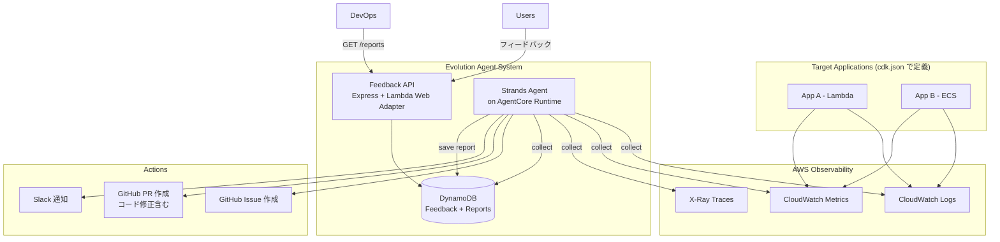
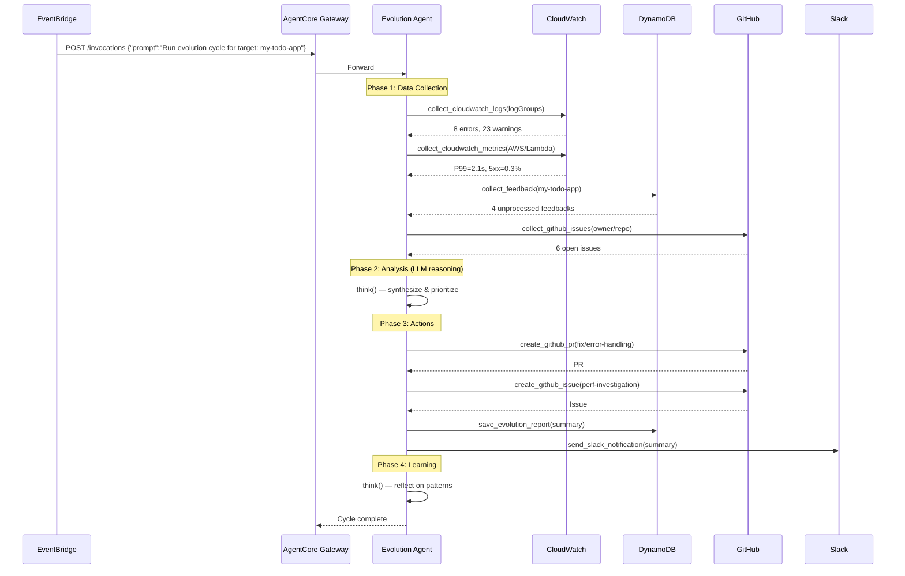

# Evolution Agent — 汎用クラウドアプリケーション自己発展エージェント

## 1. コンセプト

**あらゆるクラウドアプリケーションに接続し、自律的に改善を推進する汎用 Evolution Agent**

- 特定のアプリケーションに依存しない汎用的な設計
- **監視対象は CDK デプロイ時に `cdk.json` / 環境設定ファイルで静的定義**（画面不要）
- 同一 AWS アカウント内の CloudWatch ログ・メトリクスを監視
- ユーザーフィードバックを受け付ける REST API + DynamoDB を保有
- **AgentCore Runtime** 上で稼働する Strands Agent として実装
- 分析結果から **GitHub Issue + コード修正 PR** を自動生成
- ダッシュボード不要 — **API のみで状況確認**



---

## 2. 設計方針

### なぜ AgentCore Runtime + Strands Agent か

| 要件 | AgentCore Runtime のメリット |
|------|---------------------------|
| ツール実行の柔軟性 | Strands の `tool()` で CW / GitHub / DDB 操作を自由に定義 |
| セッション・メモリ | AgentCore Memory で過去の分析結果を長期記憶 |
| スケーラビリティ | AgentCore マネージドインフラ (自動スケール、ログ統合) |
| 呼び出し | Gateway API / EventBridge スケジュール / 手動対話すべて対応 |
| moca 連携 | moca から sub-agent として呼び出し可能 |

### 監視対象の管理方針

**CDK 環境設定ファイルで静的に定義** → DynamoDB Targets テーブル不要

```
cdk deploy -c env=dev
  ↓
config/environments.ts の dev.targets[]
  ↓
CDK が環境変数として Agent/API に注入
  ↓
Agent は環境変数から対象アプリ情報を読み取り
```

---

## 3. 技術スタック

| レイヤー | 技術 | 備考 |
|---------|------|------|
| **Agent Runtime** | Strands SDK + Express on AgentCore Runtime | moca agent パターン |
| **Feedback API** | Express + Lambda Web Adapter | moca backend パターン |
| **Database** | DynamoDB (2テーブル) | Feedback, Evolution Reports |
| **IaC** | AWS CDK (TypeScript) | moca cdk constructs パターン |
| **LLM** | Amazon Bedrock (Claude) | 分析 + PR 用コード生成 |
| **Observability** | CloudWatch Logs/Metrics, X-Ray | 同一アカウント |
| **Actions** | GitHub API (gh CLI + Octokit) | Issue + コード修正 PR |

---

## 4. モノレポ構成

```
evolution-agent/
├── package.json                        # npm workspaces root
├── tsconfig.base.json
├── eslint.config.mjs
├── README.md
├── docker/
│   ├── agent.Dockerfile                # AgentCore Runtime 用 (multi-stage)
│   └── api.Dockerfile                  # Feedback API (Lambda Web Adapter) 用
│
├── packages/
│   ├── agent/                          # ★ Strands Agent (AgentCore Runtime)
│   │   ├── package.json
│   │   ├── tsconfig.json
│   │   ├── docker-compose.yml
│   │   └── src/
│   │       ├── index.ts                # Express server entry
│   │       ├── app.ts                  # Express app factory (moca pattern)
│   │       ├── agent.ts                # createAgent() — Strands Agent 生成
│   │       ├── config/
│   │       │   └── index.ts            # Zod env validation + logger + targets parsing
│   │       ├── handlers/
│   │       │   ├── index.ts
│   │       │   ├── invocations.ts      # POST /invocations
│   │       │   └── types.ts
│   │       ├── prompts/
│   │       │   ├── index.ts
│   │       │   └── system-prompt.ts    # Evolution Agent 専用システムプロンプト
│   │       ├── tools/                  # ★ Evolution 固有ツール群
│   │       │   ├── index.ts
│   │       │   ├── think.ts
│   │       │   │
│   │       │   ├── # --- Collectors ---
│   │       │   ├── collect-cloudwatch-logs.ts
│   │       │   ├── collect-cloudwatch-metrics.ts
│   │       │   ├── collect-xray-traces.ts
│   │       │   ├── collect-feedback.ts
│   │       │   ├── collect-github-issues.ts
│   │       │   │
│   │       │   ├── # --- Actors ---
│   │       │   ├── create-github-issue.ts
│   │       │   ├── create-github-pr.ts        # ★ gh CLI でブランチ作成→修正→PR
│   │       │   ├── send-slack-notification.ts
│   │       │   └── save-evolution-report.ts
│   │       │
│   │       ├── middleware/
│   │       │   ├── request-context.ts
│   │       │   └── cors.ts
│   │       ├── context/
│   │       │   └── request-context.ts
│   │       └── models/
│   │           └── bedrock.ts
│   │
│   ├── api/                            # ★ Feedback & Reports API
│   │   ├── package.json
│   │   ├── tsconfig.json
│   │   └── src/
│   │       ├── index.ts
│   │       ├── config/
│   │       │   └── index.ts            # Zod env validation
│   │       ├── middleware/
│   │       │   └── auth.ts             # API Key 認証 + JWT 認証
│   │       ├── routes/
│   │       │   ├── feedback.ts         # POST/GET /feedback
│   │       │   └── reports.ts          # GET /reports
│   │       ├── services/
│   │       │   ├── feedback-dynamodb.ts
│   │       │   └── reports-dynamodb.ts
│   │       └── utils/
│   │           ├── jwks.ts
│   │           └── logger.ts
│   │
│   └── cdk/                            # ★ AWS CDK IaC
│       ├── package.json
│       ├── tsconfig.json
│       ├── cdk.json
│       ├── bin/
│       │   └── app.ts
│       ├── config/
│       │   ├── index.ts                # re-exports
│       │   ├── environment-types.ts    # 型定義 (★ TargetConfig 含む)
│       │   ├── environments.ts         # ★ targets[] をここに定義
│       │   └── environment-utils.ts
│       └── lib/
│           ├── evolution-agent-stack.ts
│           └── constructs/
│               ├── auth/
│               │   └── cognito-auth.ts
│               ├── agentcore/
│               │   ├── agentcore-runtime.ts
│               │   ├── agentcore-gateway.ts
│               │   └── agentcore-memory.ts
│               ├── api/
│               │   └── feedback-api.ts
│               ├── storage/
│               │   └── evolution-tables.ts
│               └── scheduling/
│                   └── evolution-scheduler.ts
```

---

## 5. CDK 環境設定 — 監視対象の定義

### 5.1 型定義

```typescript
// config/environment-types.ts

/**
 * 監視対象アプリケーション設定
 * cdk deploy 時に静的に定義
 */
export interface TargetConfig {
  /** 対象アプリ ID (一意識別子) */
  id: string;
  /** 対象アプリ名 */
  name: string;
  /** CloudWatch 監視設定 */
  cloudwatch: {
    /** 監視対象 Log Group 名 */
    logGroupNames: string[];
    /** カスタムメトリクス Namespace (任意) */
    namespace?: string;
    /** Lambda 関数名 (Lambda メトリクス自動収集用) */
    lambdaFunctionNames?: string[];
  };
  /** GitHub リポジトリ設定 */
  github: {
    owner: string;
    repo: string;
    defaultBranch?: string; // default: 'main'
  };
  /** Slack 通知設定 (任意) */
  slack?: {
    webhookSecretName: string; // Secrets Manager のシークレット名
  };
}

export interface EnvironmentConfig {
  env: Environment;
  resourcePrefix: string;
  deletionProtection: boolean;
  corsAllowedOrigins: string[];
  githubTokenSecretName?: string;

  /** ★ 監視対象アプリケーション一覧 */
  targets: TargetConfig[];
}
```

### 5.2 環境定義例

```typescript
// config/environments.ts
export const environments: Record<Environment, EnvironmentConfigInput> = {
  default: {
    targets: [],
  },

  dev: {
    githubTokenSecretName: 'evolution-agent/dev/github-token',
    targets: [
      {
        id: 'my-todo-app',
        name: 'My TODO App',
        cloudwatch: {
          logGroupNames: [
            '/aws/lambda/my-todo-backend',
            '/aws/lambda/my-todo-api',
          ],
          namespace: 'MyTodoApp',
          lambdaFunctionNames: ['my-todo-backend', 'my-todo-api'],
        },
        github: {
          owner: 'daisuke-awaji',
          repo: 'my-todo-app',
          defaultBranch: 'main',
        },
        slack: {
          webhookSecretName: 'evolution-agent/dev/slack-webhook-my-todo',
        },
      },
      {
        id: 'moca',
        name: 'Moca Chat Application',
        cloudwatch: {
          logGroupNames: [
            '/aws/bedrock-agentcore/runtimes/moca-runtime',
            '/aws/lambda/moca-backend',
          ],
        },
        github: {
          owner: 'daisuke-awaji',
          repo: 'sample-multi-agent-orchestration-chat-on-agentcore',
        },
      },
    ],
  },

  prd: {
    deletionProtection: true,
    githubTokenSecretName: 'evolution-agent/prd/github-token',
    targets: [
      // 本番環境の監視対象
    ],
  },
};
```

### 5.3 CDK → Agent への受け渡し

```typescript
// CDK construct 内
runtime.addEnvironment(
  'EVOLUTION_TARGETS',
  JSON.stringify(envConfig.targets)
);

// Agent config/index.ts 内
const envSchema = z.object({
  EVOLUTION_TARGETS: z.string().transform((val) => {
    const parsed = JSON.parse(val);
    return z.array(targetConfigSchema).parse(parsed);
  }),
  // ...
});
```

---

## 6. データモデル (DynamoDB — 2テーブル)

Targets テーブルは不要 (CDK 管理)。Feedback と Reports の2テーブルのみ。

### 6.1 Feedback テーブル

| Attribute | Type | 説明 |
|-----------|------|------|
| `targetId` (PK) | string | 対象アプリ ID (CDK 定義の id) |
| `feedbackId` (SK) | string | `FB#<timestamp>#<ulid>` (ソート可能) |
| `userId` | string? | 送信者 (匿名可) |
| `type` | `bug` \| `feature` \| `improvement` \| `praise` \| `general` | 種別 |
| `message` | string | 本文 |
| `rating` | number? | 1-5 |
| `metadata` | object? | URL, ブラウザ, app version 等 |
| `processed` | boolean | Agent 処理済みフラグ |
| `processedAt` | string? | 処理日時 |
| `evolutionReportId` | string? | 関連レポート ID |
| `createdAt` | string | 作成日時 |

**GSI `processed-index`**: `targetId` (PK) + `processed` (SK) — 未処理フィードバック取得用

### 6.2 Evolution Reports テーブル

| Attribute | Type | 説明 |
|-----------|------|------|
| `targetId` (PK) | string | 対象アプリ ID |
| `reportId` (SK) | string | `RPT#<timestamp>#<ulid>` |
| `triggerType` | `scheduled` \| `manual` | トリガー種別 |
| `collectedData` | object | 収集データサマリ |
| `collectedData.logErrors` | number | エラーログ件数 |
| `collectedData.logWarnings` | number | 警告ログ件数 |
| `collectedData.feedbackCount` | number | 処理フィードバック数 |
| `collectedData.metricsSnapshot` | object | メトリクスの P50/P99/Errors |
| `analysis` | object | AI 分析結果 |
| `analysis.summary` | string | 分析サマリ |
| `analysis.issues` | Issue[] | 特定された問題 |
| `analysis.recommendations` | Recommendation[] | 改善提案 |
| `actions` | Action[] | 実行されたアクション |
| `actions[].type` | `github_issue` \| `github_pr` \| `slack_notification` | 種別 |
| `actions[].url` | string? | Issue/PR URL |
| `actions[].status` | `success` \| `failed` \| `skipped` | 結果 |
| `status` | `running` \| `completed` \| `failed` | レポート全体ステータス |
| `durationMs` | number? | 実行時間 |
| `createdAt` | string | 開始日時 |
| `completedAt` | string? | 完了日時 |

---

## 7. Agent Tools 設計

### 7.1 Collector Tools

```typescript
// tools/collect-cloudwatch-logs.ts
export const collectCloudWatchLogs = tool({
  name: 'collect_cloudwatch_logs',
  description: 'Collect error/warning logs from CloudWatch Logs Insights for a target application',
  schema: z.object({
    logGroupNames: z.array(z.string()).describe('CloudWatch Log Group names to query'),
    timeRangeHours: z.number().default(24).describe('Hours to look back'),
    severity: z.enum(['ERROR', 'WARN', 'ALL']).default('ERROR'),
    maxResults: z.number().default(100),
  }),
  handler: async (input) => {
    // CloudWatch Logs Insights:
    // fields @timestamp, @message, @logStream
    // | filter @message like /{severity}/
    // | sort @timestamp desc | limit {maxResults}
  },
});

// tools/collect-cloudwatch-metrics.ts
export const collectCloudWatchMetrics = tool({
  name: 'collect_cloudwatch_metrics',
  description: 'Collect performance metrics from CloudWatch (latency, errors, invocations)',
  schema: z.object({
    namespace: z.string().describe('CloudWatch namespace (AWS/Lambda, AWS/ApiGateway, custom)'),
    metricNames: z.array(z.string()),
    dimensions: z.array(z.object({
      name: z.string(),
      value: z.string(),
    })).optional(),
    period: z.number().default(3600),
    timeRangeHours: z.number().default(24),
    statistics: z.array(z.enum(['Average', 'Sum', 'Minimum', 'Maximum', 'p50', 'p99'])).default(['Average', 'p99']),
  }),
  handler: async (input) => { /* GetMetricData */ },
});

// tools/collect-feedback.ts
export const collectFeedback = tool({
  name: 'collect_feedback',
  description: 'Collect unprocessed user feedback from DynamoDB',
  schema: z.object({
    targetId: z.string(),
    maxResults: z.number().default(50),
  }),
  handler: async (input) => {
    // DynamoDB Query: processed-index, processed=false
  },
});

// tools/collect-github-issues.ts
export const collectGitHubIssues = tool({
  name: 'collect_github_issues',
  description: 'Collect open GitHub issues and recent PRs for context',
  schema: z.object({
    owner: z.string(),
    repo: z.string(),
    state: z.enum(['open', 'closed', 'all']).default('open'),
    labels: z.array(z.string()).optional(),
    maxResults: z.number().default(30),
  }),
  handler: async (input) => { /* gh CLI or Octokit */ },
});
```

### 7.2 Actor Tools

```typescript
// tools/create-github-issue.ts
export const createGitHubIssue = tool({
  name: 'create_github_issue',
  description: 'Create a GitHub issue with analysis results',
  schema: z.object({
    owner: z.string(),
    repo: z.string(),
    title: z.string(),
    body: z.string().describe('Markdown body with root cause analysis and suggested fix'),
    labels: z.array(z.string()).default(['auto-evolution']),
  }),
  handler: async (input) => {
    // gh issue create --repo {owner}/{repo} --title ... --body ... --label ...
  },
});

// tools/create-github-pr.ts  ★ コード修正 PR 自動作成
export const createGitHubPR = tool({
  name: 'create_github_pr',
  description: `Create a GitHub PR with code fixes. 
    Workflow: clone repo → create branch → apply changes → commit → push → create PR.
    Use this when you have a concrete code fix to propose.`,
  schema: z.object({
    owner: z.string(),
    repo: z.string(),
    baseBranch: z.string().default('main'),
    branchName: z.string().describe('New branch name (e.g., fix/error-handling-123)'),
    title: z.string(),
    body: z.string().describe('PR description with context'),
    files: z.array(z.object({
      path: z.string().describe('File path relative to repo root'),
      content: z.string().describe('Full file content after modification'),
    })).describe('Files to create or modify'),
    labels: z.array(z.string()).default(['auto-evolution']),
  }),
  handler: async (input) => {
    // 1. gh repo clone {owner}/{repo} /tmp/evolution-pr/{repo}
    // 2. git checkout -b {branchName}
    // 3. Write files
    // 4. git add . && git commit -m "..."
    // 5. git push origin {branchName}
    // 6. gh pr create --repo {owner}/{repo} --base {baseBranch} --head {branchName} ...
  },
});

// tools/save-evolution-report.ts
export const saveEvolutionReport = tool({
  name: 'save_evolution_report',
  description: 'Save evolution analysis report to DynamoDB',
  schema: z.object({
    targetId: z.string(),
    triggerType: z.enum(['scheduled', 'manual']),
    summary: z.string(),
    collectedData: z.object({
      logErrors: z.number(),
      logWarnings: z.number(),
      feedbackCount: z.number(),
      metricsSnapshot: z.record(z.unknown()).optional(),
    }),
    issues: z.array(z.object({
      title: z.string(),
      severity: z.enum(['critical', 'high', 'medium', 'low']),
      description: z.string(),
      rootCause: z.string().optional(),
    })),
    actions: z.array(z.object({
      type: z.enum(['github_issue', 'github_pr', 'slack_notification']),
      url: z.string().optional(),
      status: z.enum(['success', 'failed', 'skipped']),
      detail: z.string().optional(),
    })),
  }),
  handler: async (input) => { /* DynamoDB PutItem */ },
});

// tools/send-slack-notification.ts
export const sendSlackNotification = tool({
  name: 'send_slack_notification',
  description: 'Send evolution summary to Slack',
  schema: z.object({
    webhookSecretName: z.string(),
    message: z.string(),
    severity: z.enum(['info', 'warning', 'critical']),
  }),
  handler: async (input) => {
    // SecretsManager → get webhook URL → POST
  },
});
```

---

## 8. Agent System Prompt

```typescript
export const EVOLUTION_AGENT_SYSTEM_PROMPT = `
You are an **Evolution Agent** — an autonomous AI agent that monitors cloud applications
and drives continuous improvement through data-driven analysis and automated code fixes.

## Your Targets
The following applications are registered for monitoring:
{TARGETS_JSON}

## Workflow — Evolution Cycle

### Phase 1: Data Collection
For each target:
1. \`collect_cloudwatch_logs\` — errors, warnings, stack traces
2. \`collect_cloudwatch_metrics\` — latency, error rates, invocations
3. \`collect_feedback\` — unprocessed user feedback from DynamoDB
4. \`collect_github_issues\` — current open issues for duplicate detection

### Phase 2: Analysis
5. Synthesize all data. Identify:
   - **Error patterns** — recurring errors, new error types, trends
   - **Performance issues** — latency spikes, throttling, cold starts
   - **User pain points** — complaints, feature requests, satisfaction
   - **Regressions** — issues after recent changes
6. Prioritize by severity × impact

### Phase 3: Action
7. For each actionable finding:
   - If a **concrete code fix** is possible → \`create_github_pr\` with the fix
   - If analysis-only / needs human decision → \`create_github_issue\`
   - **Always check existing issues first** to avoid duplicates
8. If Slack is configured → \`send_slack_notification\`
9. \`save_evolution_report\` to record all findings and actions

### Phase 4: Learning
10. \`think\` — reflect on:
    - Are previous recommendations being addressed?
    - What patterns recur across cycles?
    - What new monitoring might help?

## Principles
- **Be specific**: include exact log lines, metric values, timestamps
- **Be actionable**: every issue must have a concrete suggested fix
- **Create PRs for clear fixes**: code-level issues get automated PRs, not just issues
- **Avoid duplicates**: always check \`collect_github_issues\` before creating new ones
- **Prioritize ruthlessly**: only act on genuine, impactful problems
- **Track progress**: reference previous reports for trend analysis
`;
```

---

## 9. Feedback API 設計

### 9.1 Endpoints

```
POST   /feedback                     # フィードバック送信 (API Key)
GET    /feedback?targetId=xxx        # フィードバック一覧 (JWT)
GET    /feedback?targetId=xxx&processed=false  # 未処理のみ

GET    /reports?targetId=xxx         # 進化レポート一覧 (JWT)
GET    /reports/:targetId/:reportId  # レポート詳細 (JWT)

GET    /ping                         # ヘルスチェック
```

### 9.2 外部アプリからのフィードバック送信

```typescript
// 対象アプリ側 — シンプルな HTTP POST
await fetch('https://<evolution-api-url>/feedback', {
  method: 'POST',
  headers: {
    'Content-Type': 'application/json',
    'X-API-Key': '<api-key>',
    'X-Target-Id': '<target-id>',  // CDK で定義した id
  },
  body: JSON.stringify({
    type: 'bug',
    message: 'ログイン後にTODOリストが表示されない',
    rating: 2,
    metadata: { url: '/todos', browser: 'Chrome 120' },
  }),
});
```

### 9.3 認証

| ルート | 認証方式 | 用途 |
|--------|---------|------|
| `POST /feedback` | **API Key** (`X-API-Key` ヘッダー) | 外部アプリからの送信 |
| `GET /feedback` | **Cognito JWT** | 管理者がフィードバック確認 |
| `GET /reports` | **Cognito JWT** | 管理者がレポート確認 |
| `GET /ping` | なし | ヘルスチェック |

API Key は CDK デプロイ時に生成し、Secrets Manager に保存。対象アプリごとに個別の API Key を発行。

```typescript
// config/environment-types.ts — TargetConfig に追加
export interface TargetConfig {
  // ...
  /** API Key の Secrets Manager シークレット名 */
  apiKeySecretName?: string;
}
```

---

## 10. CDK インフラ構成

```typescript
// lib/evolution-agent-stack.ts
export class EvolutionAgentStack extends cdk.Stack {
  constructor(scope: Construct, id: string, props: EvolutionAgentStackProps) {
    super(scope, id, props);

    const { envConfig } = props;

    // 1. 認証 (Cognito — 管理 API 用)
    const auth = new CognitoAuth(this, 'Auth', {
      userPoolName: `${envConfig.resourcePrefix}-users`,
    });

    // 2. ストレージ (DynamoDB — Feedback + Reports のみ)
    const tables = new EvolutionTables(this, 'Tables', {
      resourcePrefix: envConfig.resourcePrefix,
    });

    // 3. AgentCore Memory
    const memory = new AgentCoreMemory(this, 'Memory', {
      memoryName: `${envConfig.resourcePrefix}-memory`,
    });

    // 4. AgentCore Gateway
    const gateway = new AgentCoreGateway(this, 'Gateway', {
      cognitoAuth: auth,
    });

    // 5. AgentCore Runtime (Strands Agent)
    //    ★ EVOLUTION_TARGETS 環境変数で監視対象を注入
    const runtime = new AgentCoreRuntime(this, 'Runtime', {
      runtimeName: `${envConfig.resourcePrefix}-agent`,
      cognitoAuth: auth,
      gateway,
      memory: { memoryId: memory.memoryId },
      environmentVariables: {
        EVOLUTION_TARGETS: JSON.stringify(envConfig.targets),
        FEEDBACK_TABLE_NAME: tables.feedbackTable.tableName,
        REPORTS_TABLE_NAME: tables.reportsTable.tableName,
      },
    });

    // Agent に CloudWatch 読み取り権限を付与
    runtime.addToRolePolicy(new iam.PolicyStatement({
      actions: [
        'logs:StartQuery', 'logs:GetQueryResults', 'logs:StopQuery',
        'logs:FilterLogEvents', 'logs:DescribeLogGroups',
      ],
      resources: envConfig.targets.flatMap(t =>
        t.cloudwatch.logGroupNames.map(lg =>
          `arn:aws:logs:${this.region}:${this.account}:log-group:${lg}:*`
        )
      ),
    }));

    runtime.addToRolePolicy(new iam.PolicyStatement({
      actions: ['cloudwatch:GetMetricData', 'cloudwatch:GetMetricStatistics', 'cloudwatch:ListMetrics'],
      resources: ['*'],
    }));

    // DynamoDB 読み書き権限
    tables.feedbackTable.grantReadWriteData(runtime.role);
    tables.reportsTable.grantReadWriteData(runtime.role);

    // 6. Feedback API (Lambda Web Adapter)
    const feedbackApi = new FeedbackApi(this, 'FeedbackApi', {
      cognitoAuth: auth,
      feedbackTable: tables.feedbackTable,
      reportsTable: tables.reportsTable,
      targets: envConfig.targets,
    });

    // 7. EventBridge スケジューラ
    const scheduler = new EvolutionScheduler(this, 'Scheduler', {
      gateway,
      targets: envConfig.targets,
    });
  }
}
```

### Dockerfile (Agent — moca パターン)

```dockerfile
# docker/agent.Dockerfile
FROM public.ecr.aws/docker/library/node:22-slim AS builder
WORKDIR /build
COPY package*.json tsconfig.base.json ./
COPY packages/agent/package*.json packages/agent/tsconfig.json ./packages/agent/
RUN npm ci
COPY packages/agent/src/ ./packages/agent/src/
RUN cd packages/agent && npm run build

FROM public.ecr.aws/docker/library/node:22-slim
RUN apt-get update && apt-get install -y curl git && rm -rf /var/lib/apt/lists/*
# GitHub CLI
RUN curl -fsSL https://cli.github.com/packages/githubcli-archive-keyring.gpg | \
    dd of=/usr/share/keyrings/githubcli-archive-keyring.gpg && \
    echo "deb [arch=$(dpkg --print-architecture) signed-by=/usr/share/keyrings/githubcli-archive-keyring.gpg] https://cli.github.com/packages stable main" | \
    tee /etc/apt/sources.list.d/github-cli.list > /dev/null && \
    apt-get update && apt-get install -y gh && rm -rf /var/lib/apt/lists/*
WORKDIR /app
COPY --from=builder /build/packages/agent/dist ./packages/agent/dist
COPY --from=builder /build/packages/agent/package*.json ./packages/agent/
COPY --from=builder /build/package*.json ./
RUN npm ci --omit=dev --ignore-scripts
EXPOSE 8080
CMD ["node", "packages/agent/dist/index.js"]
```

---

## 11. Evolution Cycle シーケンス



---

## 12. 開発フェーズ

### Phase 1: Agent Core (Week 1-2)
- [ ] モノレポ初期化 (npm workspaces, tsconfig, eslint)
- [ ] `packages/agent`: Strands Agent 基盤
  - [ ] app.ts, agent.ts, handlers, config (targets 環境変数パース)
  - [ ] System Prompt
  - [ ] `collect_cloudwatch_logs`
  - [ ] `collect_cloudwatch_metrics`
  - [ ] `collect_feedback`
  - [ ] `save_evolution_report`
  - [ ] `think`
- [ ] `packages/agent`: Dockerfile + docker-compose (ローカル動作確認)

### Phase 2: API + CDK (Week 2-3)
- [ ] `packages/api`: Feedback API
  - [ ] POST /feedback (API Key 認証)
  - [ ] GET /feedback (JWT 認証)
  - [ ] GET /reports (JWT 認証)
- [ ] `packages/cdk`: 全 Constructs
  - [ ] 環境設定 (config/ + TargetConfig 型)
  - [ ] CognitoAuth, EvolutionTables
  - [ ] AgentCore Runtime / Gateway / Memory
  - [ ] FeedbackApi (Lambda Web Adapter)
  - [ ] EvolutionScheduler (EventBridge)
- [ ] 初回デプロイ

### Phase 3: GitHub Actions (Week 3-4)
- [ ] `create_github_issue` tool
- [ ] `create_github_pr` tool (gh CLI ベース)
- [ ] `collect_github_issues` tool
- [ ] `send_slack_notification` tool
- [ ] E2E テスト (実際の対象アプリを登録して Evolution Cycle 実行)

### Phase 4: Hardening (Week 4+)
- [ ] `collect_xray_traces` tool
- [ ] エラーハンドリング強化
- [ ] Agent Memory 活用 (過去レポートとの比較)
- [ ] API Key 自動生成 + Secrets Manager 統合
- [ ] Feedback SDK (npm package) 提供

---

## 13. 前回計画からの変更点

| 項目 | 前回 | 今回 |
|------|------|------|
| Targets 管理 | DynamoDB テーブル + CRUD API | ★ CDK 環境設定で静的定義 |
| テーブル数 | 3 (Targets, Feedback, Reports) | **2** (Feedback, Reports) |
| クロスアカウント | 将来考慮 | **対象外** (同一アカウント) |
| Agent アクション | Issue 作成のみ | ★ **Issue + コード修正 PR** |
| ダッシュボード | 将来対応 | **不要** — API のみ |
| ログ権限 | `*` (全 Log Group) | ★ targets で定義した Log Group のみに限定 |

